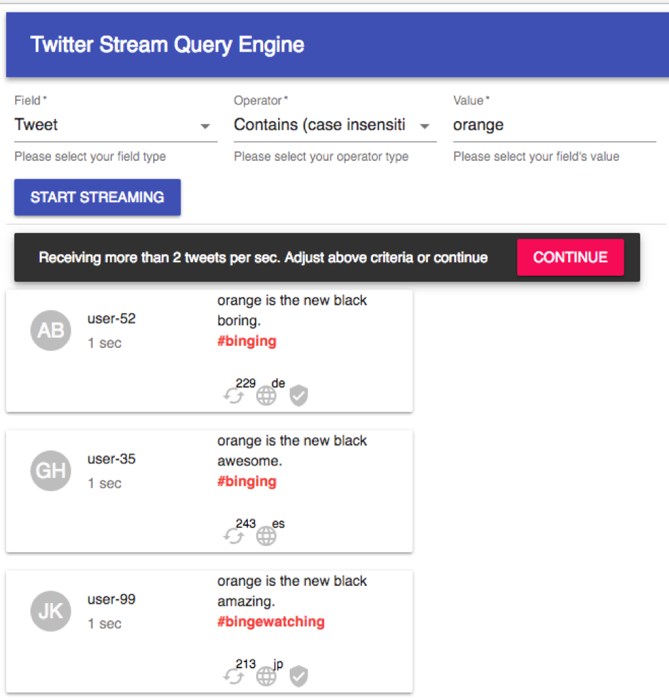

# Twitter Stream Query Engine

Application URL
###https://twitter-query-engine.herokuapp.com

This UI allows you to query against a real-time stream of tweets produced by an external Tweet Streaming Service.
The results of the query is streamed to client in near real-time. 

User can setup only 1 query condition for now. 

Twitter firehose is handled by NodeJS middleware to filter based on query passed by client(browser).

Client( Browser) <----stream--- NodeJS (Middleware/filter) <----stream----- TwitterStream

Key implementation pending:

1. Throttling streaming speed at middleware by using database
2. Once throttling is fixed in middleware then 2 tps threshold stopper will be removed and infinite scrolling will have to be implemented
3. Support multiple query feature in UI
4. UX changes based on customer's need


How to run it locally
1. Go to terminal and clone code from github ```git clone https://github.com/sachinjha1/twitter-query-engine.git```
2. Change directory to project folder ```cd twitter-query-engine```
3. Run npm install ```npm install```
4. Start local server ```npm start``` Built bundle is already checked in. 
To re-build bundle run ```npm run webpack```
5. Open browser and go to ```http://localhost:8080/```

In case of any local code change
 1. Run build again ```npm run webpack```
 2. Stop the server if its already started. ```ctrl+c``` 
 3. Start the server ```npm start```
 
 ### Screenshot
 